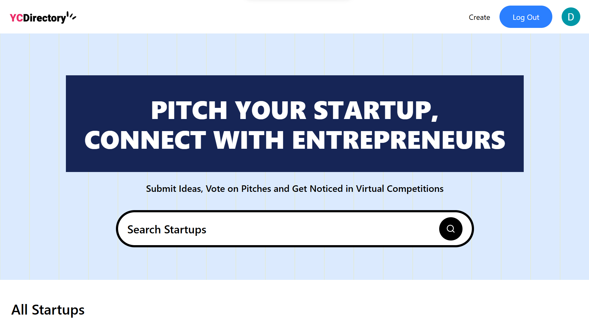

# YC Directory - Pitch, Vote, and Grow



Welcome to the YC Directory, a dynamic web application where entrepreneurs and innovators can pitch their startup ideas, and the community can discover, vote, and engage with them. This platform is built to foster a community of builders, providing a space to share ideas and gain visibility.

**Live Demo:** [https://yc-directory-2-2.vercel.app/](https://yc-directory-2-2.vercel.app/)

## About The Project

This project is a full-stack application designed to replicate the core experience of a startup directory like Y Combinator's. It allows users to authenticate, submit their own startup pitches, view startups submitted by others, and search for ideas by keyword, category, or author.

The application is built with a modern, robust, and scalable tech stack, emphasizing a great developer experience and a seamless user experience.

## Key Features

-   **Full Authentication:** Secure user sign-up and login using NextAuth.js, supporting various OAuth providers.
-   **Startup Submission:** Authenticated users can submit their startup ideas through a rich-text Markdown editor.
-   **Dynamic Content:** All startup data is managed through the Sanity.io headless CMS, allowing for easy content updates.
-   **Advanced Search:** A powerful, case-insensitive, partial-matching search allows users to find startups by title, category, description, or author.
-   **User Profiles:** Each user has a public profile page displaying their bio and all the startups they have submitted.
-   **Fully Responsive Design:** The application is built with a mobile-first approach, featuring a fluid grid layout that adapts beautifully to any screen size.
-   **Optimistic UI & Loading States:** Custom loading screens and skeleton loaders provide a smooth and professional user experience during page transitions and data fetching.
-   **Graceful Empty States:** Custom placeholder components are used for missing images and empty content sections, ensuring the UI remains clean and informative.

## Tech Stack

This project is built with a modern, component-based architecture.

-   **Framework:** [Next.js](https://nextjs.org/) (v15 with App Router)
-   **Styling:** [Tailwind CSS](https://tailwindcss.com/)
-   **Headless CMS:** [Sanity.io](https://www.sanity.io/)
-   **Authentication:** [NextAuth.js](https://next-auth.js.org/)
-   **UI Components:** [shadcn/ui](https://ui.shadcn.com/) & custom reusable components
-   **Form Management:** React `useActionState` Hook
-   **Validation:** [Zod](https://zod.dev/)

## Getting Started

To get a local copy up and running, follow these simple steps.

### Prerequisites

-   Node.js (v18 or later)
-   pnpm (or your package manager of choice)
-   A Sanity.io account and project
-   An OAuth provider for NextAuth.js (e.g., Google, GitHub)

### Installation

1.  **Clone the repo:**
    ```sh
    git clone https://github.com/Nylite-soda/yc_directory2-2.git
    cd yc_directory2-2
    ```

2.  **Install packages:**
    ```sh
    pnpm install
    ```

3.  **Set up environment variables:**
    Create a `.env.local` file in the root of your project and add the following variables. You will need to get these from your Sanity project dashboard and your OAuth provider configuration.

    ```env
    # Sanity
    NEXT_PUBLIC_SANITY_PROJECT_ID="..."
    NEXT_PUBLIC_SANITY_DATASET="..."
    NEXT_PUBLIC_SANITY_API_VERSION="..."
    SANITY_API_READ_TOKEN="..."
    SANITY_API_WRITE_TOKEN="..."

    # NextAuth.js
    AUTH_SECRET="..."
    AUTH_GOOGLE_ID="..."
    AUTH_GOOGLE_SECRET="..."
    ```

4.  **Run the development server:**
    ```sh
    pnpm dev
    ```

    Open [http://localhost:3000](http://localhost:3000) with your browser to see the result.

### Build for Production

To create a production-ready build, run:
```sh
pnpm build
```

## License

Distributed under the MIT License. See `LICENSE` for more information.